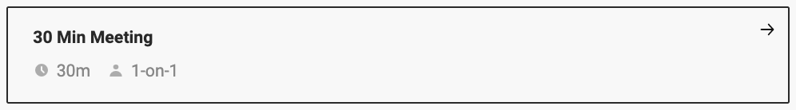

I'm a Full Stack Developer based in Bangladesh, currently pursuing my degree in Computer Science and Engineering. Some technologies I enjoy working with include ReactJS, NexJS, Typescript , MongoDB and PostgreSQL. I'm always eager to expand my skill set. Currently, I'm learning web3.

### 🧿 Like to meet me?

Pick a slot if you'd like to meet me and chat about anything you are passionate about - but make sure to describe the agenda

<a href="https://calendly.com/najmulbinnurul/30min" target="_blank"></a>

###  A little more about me...


## 📫 Let's connect!

### Hit in your console or terminal .

```bash
npx najmul
```

### Or

<a href="https://discord.com/channels/@slise.web3" target="_blank">

Feel free to explore my GitHub repositories and don't hesitate to reach out for collaboration or just to chat about technology! 😊
